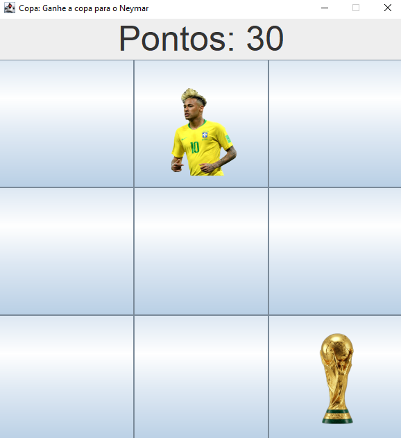

# ⚽ Copa do Neymar — Jogo em Java Swing

<p align="center">
  
  
  
  
</p>

<p align="center">
  Jogo de reflexo desenvolvido em <strong>Java Swing</strong> como projeto de aprendizado.<br/>
  Clique no Neymar para marcar pontos — mas cuidado com a taça!
</p>

---

## 🎮 Sobre o Projeto

**Copa do Neymar** é um minijogo de clique e reflexo inspirado no estilo *whack-a-mole*. O jogador deve clicar no Neymar enquanto ele aparece aleatoriamente em um tabuleiro 3×3, acumulando pontos. Se clicar na taça da copa, perde tudo!

Este projeto foi desenvolvido como estudo prático de **Java e interface gráfica com Swing**, seguindo o tutorial do canal [Bro Code no YouTube](https://youtu.be/rIQksHTwZzA?si=JmMSyGgCIJAo5RGb).

---

## ✨ Funcionalidades

- 🟩 Tabuleiro 3×3 com 9 botões clicáveis
- 🧑‍🦱 Neymar aparece em posições aleatórias a cada segundo
- 🏆 Taça da copa aparece simultaneamente como armadilha
- 🔢 Placar atualizado em tempo real (+10 pontos por clique certo)
- 💥 Game over ao clicar na taça (botões desativados, pontuação final exibida)
- 🖼️ Imagens redimensionadas automaticamente para 150×150px

---

## 📸 Demonstração
<p align="center">
  
  <br>
  <em>Tela inicial do jogo</em>
</p>

> O Neymar e a taça aparecem e somem a cada 1 segundo em posições diferentes.

---

## 🗂️ Estrutura do Projeto

```
copagame/
├── src/
│   ├── main.java           # Ponto de entrada — instancia o jogo
│   ├── gamecopa.java       # Lógica principal do jogo (UI + Timers + Eventos)
│   ├── Neymar.png          # Imagem do Neymar usada nos botões
│   ├── tacacopa26.png      # Imagem da taça (armadilha)
│   └── fundo_estadio.jpg   # Imagem de fundo (asset extra)
├── out/
│   └── production/
│       └── copagame/       # Arquivos .class compilados (gerados pelo IntelliJ)
├── .idea/                  # Configurações do IntelliJ IDEA
├── copagame.iml            # Arquivo de módulo do IntelliJ
└── .gitignore
```

---

## 🧠 Conceitos de Java Praticados

| Conceito | Onde foi usado |
|---|---|
| **Classes e instâncias** | `gamecopa` e `main` são classes separadas |
| **Java Swing** | `JFrame`, `JPanel`, `JButton`, `JLabel` para montar a janela |
| **Layout Managers** | `BorderLayout` e `GridLayout` para organizar componentes |
| **Eventos (ActionListener)** | Detecta cliques nos botões com classes anônimas |
| **Timer (javax.swing)** | Controla a animação do Neymar e da taça a cada 1 segundo |
| **Random** | Escolhe posições aleatórias no tabuleiro |
| **ImageIcon / Image** | Carrega e redimensiona imagens com `getScaledInstance()` |
| **Arrays** | `JButton[] board` armazena os 9 botões do tabuleiro |
| **Condicionais** | Verifica se o botão clicado é o Neymar ou a taça |

---

## 🚀 Como Executar

### Pré-requisitos

- [Java JDK 8+](https://www.oracle.com/java/technologies/downloads/) instalado
- [IntelliJ IDEA](https://www.jetbrains.com/idea/) (recomendado) **ou** qualquer IDE Java

### Passos

1. **Clone o repositório:**
   ```bash
   git clone https://github.com/seu-usuario/copagame.git
   cd copagame
   ```

2. **Abra no IntelliJ IDEA:**
   - `File` → `Open` → selecione a pasta `copagame`

3. **Execute o projeto:**
   - Abra `src/main.java`
   - Clique no botão ▶️ verde (Run) ou pressione `Shift + F10`

4. **Via terminal (sem IDE):**
   ```bash
   cd src
   javac main.java gamecopa.java
   java main
   ```

---

## 🎯 Como Jogar

1. A janela abrirá com um tabuleiro 3×3
2. O **Neymar** e a **taça** aparecem em posições aleatórias a cada segundo
3. **Clique no Neymar** → ganha **+10 pontos**
4. **Clique na taça** → **Game Over!** O placar congela e os botões são desativados
5. Feche e reabra o programa para jogar novamente

---

## 📚 Tutorial de Referência

Este projeto foi desenvolvido acompanhando o tutorial:

> 📺 **[Java Swing Game Tutorial — Bro Code](https://youtu.be/rIQksHTwZzA?si=JmMSyGgCIJAo5RGb)**

O código foi adaptado com ajustes de nomes de variáveis, comentários em português e pequenas modificações para fins de aprendizado pessoal.

---

## 🛠️ Tecnologias Utilizadas

- **Java SE** (versão 8+)
- **Java Swing** — biblioteca gráfica padrão do Java
- **IntelliJ IDEA** — IDE utilizada no desenvolvimento

---

## 👨‍💻 Autor

Desenvolvido por **GABRIEL MENDES** como projeto de estudo de Java — 1º semestre de Engenharia de Software.

- GitHub: gabrielbatistamendes2016-prog (https://github.com/gabrielbatistamendes2016-prog)

---

## 📄 Licença

Este projeto é de uso educacional e foi criado para fins de aprendizado pessoal.  
As imagens utilizadas (Neymar, taça) pertencem aos seus respectivos proprietários.

---

<p align="center">
  Feito com ☕ Java e muito aprendizado!
</p>

